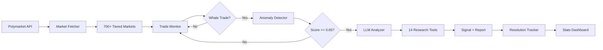

<div align="center">

# Polymarket Whale Watcher

**AI-powered whale trade surveillance for Polymarket prediction markets**

[](https://www.python.org/downloads/)
[](LICENSE)
[](https://docs.polymarket.com/)

Real-time monitoring | Tiered market coverage | LLM investigation with 14 autonomous tools | Signal accuracy tracking

[Quick Start](#-quick-start) | [How It Works](#-how-it-works) | [Features](#-features) | [Configuration](#-configuration) | [Dashboard](#-dashboard)

</div>

---

## What It Does

Whale Watcher continuously monitors **700+ active Polymarket markets** across three volume tiers, detects large trades with anomalous patterns, and uses an LLM agent with **14 autonomous research tools** to investigate whether the trader may possess an information advantage. It tracks signal accuracy over time, generates daily briefings, and sends real-time email alerts for high-confidence signals.

```
Tiered Markets  →  Whale Detection  →  Anomaly Scoring  →  LLM Investigation  →  Signal Tracking
   (700+)           ($5k-$100k+)       (5 dimensions)     (14 tools, 3 rounds)   (win rate, ROI)
```

---

## Demo

<details open>
<summary><b>Terminal Output</b> — Real-time whale detection and analysis</summary>

```
$ python -m src.main run

============================================================
WHALE WATCHER STARTED
============================================================
Monitoring: 765 markets
Interval: 10 seconds
Min Trade Size: $10,000 USD
Price Range: 0.1 - 0.9
============================================================

Tiered monitoring: Tier1=8 (>500K), Tier2=198 (>10K), Tier3=559 (>1K)

[22:05:14] WHALE TRADE DETECTED!
           Amount: $5,000.00 USDC
           Side: BUY Yes
           Price: 0.7962
           Market: Over $20M committed to the Printr public sale?

           Generating analysis report...
           Round 1: LLM requested 3 tool call(s)
           → search_web("Printr public sale Sonar raise commitments")
           → search_twitter("Printr PRINT token sale commitments")
           → search_telegram("Printr public sale Sonar raise")
           Round 2: LLM requested 2 tool call(s)
           → search_web("Printr PRINT token sale total raised April 28")
           → search_twitter("Printr sale oversubscribed April 28")

           Analysis complete after 3 round(s)
           Information Asymmetry Score: 0.22 (LOW)
           Trader Credibility: LOW (#2650076, PnL: -$207K)
           Report saved: reports/20260428/...
```

</details>

<details>
<summary><b>Analysis Report</b> — LLM investigation with autonomous tool-use</summary>

Each whale trade generates a detailed markdown report:

- **Trade details** — amount, direction, price, trader wallet
- **Trader profile** — leaderboard rank, PnL, history, recent trades
- **Event positions** — whale's positions across related markets (hedge detection)
- **Market top holders** — Top 5 buyers/sellers with rankings
- **LLM investigation** — autonomous tool calls (web, Twitter, Telegram, on-chain, DeFi)
- **Information asymmetry assessment** — score, evidence, reasoning

See full example: [docs/examples/sample_report.md](docs/examples/sample_report.md)

</details>

<details>
<summary><b>Daily Briefing</b> — Automated intelligence summary</summary>

Daily briefings are generated at 10:00 AM local time and emailed automatically. They include:
- High-confidence signals (IAS >= 60%) with full analysis
- Fallback: top 5 signals by score if none reach 60%
- Price volatility alerts
- Historical signal performance (win rate, ROI by confidence tier)

See full example: [docs/examples/sample_briefing.md](docs/examples/sample_briefing.md)

</details>

---

## Quick Start

### One-Click Setup

```bash
git clone https://github.com/chaoleiyv/polymarket-whale-watcher.git
cd polymarket-whale-watcher
chmod +x setup.sh && ./setup.sh
```

The setup script will:
1. Check Python 3.10+ is installed
2. Create a virtual environment
3. Install all dependencies
4. Create `.env` from template

Then add your API key and start:

```bash
# Add your Gemini API key (the only required key)
echo "GEMINI_API_KEY=your_key_here" >> .env

# Activate the environment and run
source .venv/bin/activate
python -m src.main run
```

> **Get a free Gemini API key**: https://aistudio.google.com/apikey

### Docker

```bash
docker build -t whale-watcher .
docker run --env-file .env -v ./data:/app/data -v ./reports:/app/reports whale-watcher
```

---

## Features

| Feature | Description |
|---------|-------------|
| **Tiered Market Monitoring** | 700+ markets across 3 tiers: Tier1 (>$500K, 15s), Tier2 (>$10K, 60s), Tier3 (>$1K, 300s) |
| **Anomaly Detection** | 5-factor scoring: premium ratio, signal cleanliness, depth ratio, cluster signals, base confidence |
| **Trader Profiling** | Leaderboard ranking, PnL, trading history, event positions, market top holders |
| **LLM Analysis** | 14 autonomous tools across up to 3 rounds of investigation |
| **Signal Tracking** | Automatic market resolution checking every 30 min, win rate stats by confidence tier |
| **Daily Briefing** | Automated 10:00 AM summary with high-confidence signals, emailed to configured recipients |
| **Email Alerts** | Real-time notifications for high information-asymmetry signals (>= 60%) |
| **Web Dashboard** | FastAPI-based signal performance dashboard |

### 14 LLM Research Tools

The LLM agent autonomously selects and uses these tools during investigation:

| Category | Tools |
|----------|-------|
| **Social Sentiment** | `search_twitter`, `search_telegram`, `search_web` |
| **Crypto Data** | `get_crypto_price`, `get_crypto_market_overview`, `get_protocol_tvl`, `get_token_unlocks`, `get_protocol_revenue` |
| **Financial Data** | `get_stock_price`, `get_stock_news`, `get_economic_data` |
| **On-Chain** | `get_wallet_transfers`, `get_contract_info` |
| **Legislation** | `get_bill_status`, `get_recent_legislation` |

---

## How It Works



### Pipeline

1. **Market Selection** — Fetches all active markets from Polymarket Gamma API, classifies into 3 tiers by 24h volume, adds token launch markets. Refreshes every 15 minutes.

2. **Trade Monitoring** — Runs parallel async tasks per market (one task per market), polls official Polymarket data-api for new taker BUY trades, deduplicates by transaction hash. Connection pool tuned for 700+ concurrent markets.

3. **Whale Pre-filter** — Multi-layer filter chain:
   - Price range: 0.10 - 0.90
   - Minimum size: $5,000 hard floor
   - Dynamic threshold: $10K base, scaled by market volume (floor $5K, cap $100K)
   - Conviction check: must pay above market mid price
   - Resolution window: 6 hours to 90 days

4. **Anomaly Scoring** — 5-factor model (max 1.0):
   - Base confidence: 0.50
   - Premium-to-threshold ratio: +0.20
   - Signal cleanliness (conviction): +0.10
   - Depth ratio (size vs liquidity): +0.10
   - Cluster tier (repeated same-direction): +0.10
   - Threshold: >= 0.65 to trigger LLM analysis

5. **LLM Investigation** — Builds rich context (trade + trader profile + event positions + market top holders + historical signals), LLM autonomously uses tools for up to 3 rounds, produces structured assessment with information asymmetry score (0-1).

6. **Signal Tracking** — Resolution tracker checks every 30 minutes for resolved markets, validates signal correctness, computes theoretical ROI. Daily briefings generated at 10:00 AM and emailed.

---

## Configuration

Copy `.env.example` to `.env` and configure:

### Required

| Variable | Description | Get It |
|----------|-------------|--------|
| `GEMINI_API_KEY` | LLM API key for analysis | [Google AI Studio](https://aistudio.google.com/apikey) |

### Optional (enhances analysis)

| Variable | Description | Get It |
|----------|-------------|--------|
| `TAVILY_API_KEY` | Web search (primary) | [tavily.com](https://tavily.com) |
| `SERPER_API_KEY` | Web search (fallback) | [serper.dev](https://serper.dev) |
| `TWITTER_API_KEY` | Twitter sentiment search | [twitterapi.io](https://twitterapi.io) |
| `POLYGON_API_KEY` | Stock/ETF/forex data | [polygon.io](https://polygon.io) |
| `FRED_API_KEY` | Economic indicators | [FRED](https://fred.stlouisfed.org/docs/api/api_key.html) |
| `ETHERSCAN_API_KEY` | On-chain wallet analysis (Polygon V2) | [etherscan.io](https://etherscan.io/apis) |
| `CONGRESS_API_KEY` | US legislation data | [congress.gov](https://api.congress.gov/) |
| `TELEGRAM_API_ID` / `TELEGRAM_API_HASH` | Telegram channel monitoring | [my.telegram.org](https://my.telegram.org) |

### LLM Settings

| Variable | Default | Description |
|----------|---------|-------------|
| `LLM_MODEL` | `gemini-3-flash-preview` | Model name (any OpenAI-compatible) |
| `LLM_BASE_URL` | Google AI endpoint | OpenAI-compatible API base URL |
| `LLM_TEMPERATURE` | `0` | LLM temperature |

### Whale Detection Tuning

| Variable | Default | Description |
|----------|---------|-------------|
| `MIN_TRADE_SIZE_USD` | `10000` | Minimum trade size to consider |
| `MIN_PRICE` / `MAX_PRICE` | `0.10` / `0.90` | Price range filter |
| `FETCH_INTERVAL_SECONDS` | `10` | Default polling interval |

### Tiered Market Monitoring

| Variable | Default | Description |
|----------|---------|-------------|
| `FULL_MARKET_SCAN` | `true` | Enable tiered monitoring (all active markets) |
| `TIER1_VOLUME_MIN` | `500000` | Tier 1 volume threshold |
| `TIER2_VOLUME_MIN` | `10000` | Tier 2 volume threshold |
| `TIER3_VOLUME_MIN` | `1000` | Tier 3 volume threshold |
| `TIER1_POLL_INTERVAL` | `15` | Tier 1 polling interval (seconds) |
| `TIER2_POLL_INTERVAL` | `60` | Tier 2 polling interval (seconds) |
| `TIER3_POLL_INTERVAL` | `300` | Tier 3 polling interval (seconds) |

### Email Alerts

| Variable | Default | Description |
|----------|---------|-------------|
| `EMAIL_ENABLED` | `false` | Enable email notifications |
| `EMAIL_SENDER` | — | Sender email address |
| `EMAIL_PASSWORD` | — | Sender email password (app password) |
| `EMAIL_RECIPIENT` | — | Comma-separated recipient emails |

---

## Commands

```bash
# Core
python -m src.main run [--debug]              # Start monitoring
python -m src.main check-markets --limit 20   # View trending markets

# Analysis
python -m src.main test-analyze <market_id>   # Test LLM on a specific market

# Reports
python -m src.main briefing --today           # Generate today's briefing
python -m src.main briefing --date 2026-04-17 # Briefing for a specific date

# Dashboard
python -m src.main dashboard --port 8000      # Start web dashboard

# Maintenance
python -m src.main migrate                    # Migrate legacy JSON to SQLite
```

---

## Dashboard

Start the web dashboard to view signal performance:

```bash
python -m src.main dashboard
# Open http://localhost:8000
```

The dashboard shows:
- Overall signal statistics (total signals, win rate, avg ROI)
- Performance breakdown by confidence tier
- Top best/worst signals by theoretical ROI
- Paginated signal history

---

## Project Structure

```
src/
├── config/settings.py              # Environment configuration (Pydantic)
├── models/                         # Data models
│   ├── market.py                   # Market, TrendingMarket
│   ├── trade.py                    # TradeActivity, WhaleTrade, TraderRanking
│   ├── decision.py                 # TradeRecommendation, LLMDecision
│   └── anomaly_signal.py           # AnomalySignal (stored signal)
├── services/                       # Business logic
│   ├── market_fetcher.py           # Polymarket Gamma API (tiered market selection)
│   ├── trade_monitor.py            # Per-market parallel monitoring (official API)
│   ├── anomaly_detector.py         # 5-factor anomaly scoring
│   ├── llm_analyzer.py             # LLM with tool-use (14 tools, 3 rounds)
│   ├── tools.py                    # Tool registry
│   ├── resolution_tracker.py       # Market resolution checking
│   ├── stats_engine.py             # Performance statistics
│   ├── daily_briefing.py           # Daily summary generation + email
│   ├── twitter_search.py           # Twitter API search
│   ├── telegram_search.py          # Telegram channel monitoring
│   ├── web_search.py               # Tavily/Serper/DuckDuckGo search
│   ├── coingecko.py                # Crypto prices and market data
│   ├── defillama.py                # DeFi TVL, revenue, token unlocks
│   ├── fred.py                     # FRED macroeconomic data
│   ├── polygon.py                  # Stock/ETF prices and news
│   ├── etherscan.py                # On-chain data (Polygon, Etherscan V2)
│   └── congress.py                 # US legislation data
├── prompts/                        # LLM system prompts
│   ├── whale_analyzer.py           # Whale trade analysis prompt
│   └── volatility_analyzer.py      # Price volatility analysis prompt
├── db/database.py                  # SQLite signal storage
└── main.py                         # CLI entry point (Typer)
```

---

## Architecture

```
                    ┌──────────────────────────────┐
                    │     Polymarket Gamma API      │
                    │   (all active markets)        │
                    └──────────────┬───────────────┘
                                   │
                    ┌──────────────▼───────────────┐
                    │        Market Fetcher         │
                    │  Tier1: >$500K  (15s poll)    │
                    │  Tier2: >$10K   (60s poll)    │
                    │  Tier3: >$1K    (300s poll)   │
                    └──────────────┬───────────────┘
                                   │
              ┌────────────────────▼────────────────────┐
              │       Trade Monitor (async, 700+)       │
              │   Official Polymarket data-api           │
              │   Per-market parallel tasks              │
              │   Pool: 50 connections, 120s timeout     │
              └────────────────────┬────────────────────┘
                                   │
              ┌────────────────────▼────────────────────┐
              │          Pre-filter + Scoring            │
              │  $5K+ size, 0.10-0.90 price, conviction │
              │  5-factor anomaly score >= 0.65          │
              └────────────────────┬────────────────────┘
                                   │
              ┌────────────────────▼────────────────────┐
              │       LLM Analyzer (14 tools)           │
              │   Up to 3 rounds of investigation       │
              │   max_tokens: 4096                      │
              ├─────────┬────────┬────────┬─────────────┤
              │ Twitter │  Web   │ DeFi   │  On-Chain   │
              │Telegram │ Search │ Crypto │  Legislation│
              └─────────┴───┬────┴────────┴─────────────┘
                            │
              ┌─────────────▼──────────────────────────┐
              │     Signal Storage (SQLite)             │
              │  → Resolution Tracker (every 30min)    │
              │  → Daily Briefing (10:00 AM + email)   │
              │  → Email Alerts (IAS >= 60%)           │
              │  → Dashboard (FastAPI)                 │
              └────────────────────────────────────────┘
```

---

## Disclaimer

This system is for research and educational purposes. Prediction market trading involves significant risk. The information asymmetry scores and analyses are AI-generated estimates, not financial advice. Always verify independently.

---

## License

MIT
