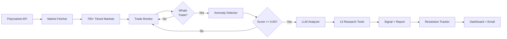

<div align="center">

# 🐋 Polymarket Whale Watcher

**AI-Powered Whale Trade Intelligence for Polymarket Prediction Markets**

[](https://www.python.org/downloads/)
[](LICENSE)
[](https://docs.polymarket.com/)
[](https://aistudio.google.com/)

<br/>

**Real-time monitoring** of 700+ markets &nbsp;·&nbsp; **14 autonomous research tools** &nbsp;·&nbsp; **Multi-step deep analysis** &nbsp;·&nbsp; **Signal accuracy tracking**

<br/>

[Quick Start](#-quick-start) &nbsp;&nbsp;|&nbsp;&nbsp; [How It Works](#-how-it-works) &nbsp;&nbsp;|&nbsp;&nbsp; [Sample Report](#-sample-report) &nbsp;&nbsp;|&nbsp;&nbsp; [Configuration](#%EF%B8%8F-configuration) &nbsp;&nbsp;|&nbsp;&nbsp; [Dashboard](#-dashboard)

---


</div>

<br/>

## What It Does

Whale Watcher continuously monitors **700+ active Polymarket markets** across three volume tiers, detects large trades with anomalous patterns, and deploys an LLM agent with **14 autonomous research tools** to conduct multi-step deep investigations. Each whale trade undergoes a structured 7-step analysis pipeline — from trader profiling and cross-market position mapping to information gap assessment — producing an **Information Asymmetry Score** that quantifies the likelihood of non-public information advantage.

<br/>

## Live Demo

<details open>
<summary><strong>Terminal Output</strong> — Real-time whale detection and analysis</summary>

<br/>

```
$ python -m src.main run

============================================================
WHALE WATCHER STARTED
============================================================
Monitoring: 765 markets
Interval: 10 seconds
Min Trade Size: $10,000 USD
Price Range: 0.1 - 0.9
============================================================

Tiered monitoring: Tier1=8 (>500K), Tier2=198 (>10K), Tier3=559 (>1K)

[23:41:12] WHALE TRADE DETECTED!
           Amount: $9,600.00 USDC
           Side: BUY Yes
           Price: 0.7142
           Market: US x Iran diplomatic meeting by June 30, 2026?

           Generating analysis report...
           Round 1: LLM requested 3 tool call(s)
           → search_web("US Iran diplomatic meeting June 2026")
           → search_twitter("US Iran meeting diplomacy")
           → get_wallet_transfers("0xceza...rn132")
           Round 2: LLM requested 2 tool call(s)
           → search_web("Islamabad Iran talks Witkoff April 2026")
           → search_twitter("POLYMARKET Iran meeting odds fading")
           Round 3: LLM requested 1 tool call(s)
           → search_web("Iran FM Araghchi 3 phase deal proposal")

           Analysis complete after 3 round(s)
           Information Asymmetry Score: 0.32 (LOW)
           Trader Credibility: MEDIUM (#1733, PnL: $84K)
           Verdict: Thesis continuation / loss recovery — HOLD/PASS
           Report saved: reports/20260504/...
```

</details>

<br/>

<details>
<summary><strong>Sample Report</strong> — 7-Step Deep Analysis (click to expand)</summary>

<br/>

Each whale trade generates a comprehensive markdown report with structured multi-step analysis:

> **Full example**: [docs/examples/sample_report.md](docs/examples/sample_report.md)

#### Report Structure

```
======================================================================
# Whale Trade Analysis Report
======================================================================

┌─ Trade Summary ─────────────────────────────────────────────────────┐
│  Market, trade size, direction, price, odds, time, trader rank     │
└─────────────────────────────────────────────────────────────────────┘

┌─ Step 2: Trade Signal Analysis ─────────────────────────────────────┐
│  Trader profile: rank, PnL, avg size, large trade ratio            │
│  Domain expertise detection, trade timing analysis                  │
└─────────────────────────────────────────────────────────────────────┘

┌─ Step 3: Event-Related Position Analysis ───────────────────────────┐
│  Cross-market positions, roll-forward detection                     │
│  Loss recovery patterns, hedge identification                       │
└─────────────────────────────────────────────────────────────────────┘

┌─ Step 4: Market Long/Short Analysis ────────────────────────────────┐
│  Top 5 bulls & bears with rankings and PnL                          │
│  Smart money consensus assessment                                   │
└─────────────────────────────────────────────────────────────────────┘

┌─ Step 5: Information Gap Analysis ──────────────────────────────────┐
│  Public information audit (web, Twitter, Telegram)                  │
│  Market pricing efficiency check                                    │
│  Non-public information evidence search                             │
└─────────────────────────────────────────────────────────────────────┘

┌─ Step 6: Historical Pattern ────────────────────────────────────────┐
│  Trader's past bets on related events                               │
│  Strategy pattern recognition (laddering, hedging, etc.)            │
└─────────────────────────────────────────────────────────────────────┘

┌─ Step 7: Information Asymmetry Assessment ──────────────────────────┐
│  Score (0–1), trader credibility, evidence, reasoning               │
│  Multi-factor summary table with signal strength                    │
│  Recommended action: BUY / HOLD / PASS                              │
└─────────────────────────────────────────────────────────────────────┘
```

#### Example Summary Table

| Factor | Assessment | Signal |
|--------|-----------|--------|
| Trader Rank/PnL | Rank #1733, $84K PnL | Moderate |
| Trade Size vs. Normal | ~$9.6K vs. avg $10K | Routine — neutral |
| Related Position | Heavy loser on May 15 market (-$6.5K) | Suppresses signal |
| Domain Expertise | Iran geopolitics specialist | Supportive |
| Public Info Coverage | Extensive public news | Reduces asymmetry |
| Smart Money Bulls | Rank #278 also long | Modest support |
| **Overall** | **Thesis continuation, not insider signal** | **Low-Medium** |

</details>

<br/>

<details>
<summary><strong>Daily Briefing</strong> — Automated intelligence summary</summary>

<br/>

Daily briefings are generated at **10:00 AM local time** and emailed automatically.

> **Full example**: [docs/examples/sample_briefing.md](docs/examples/sample_briefing.md)

**Includes:**
- High-confidence signals (IAS >= 60%) with full analysis summaries
- Fallback: top 5 signals by score if none reach the threshold
- Abnormal price volatility alerts
- Historical signal performance — win rate and ROI by confidence tier

</details>

<br/>

---

## Quick Start

### One-Click Setup

```bash
git clone https://github.com/chaoleiyv/polymarket-whale-watcher.git
cd polymarket-whale-watcher
chmod +x setup.sh && ./setup.sh
```

The setup script will:
1. Check Python 3.10+ is installed
2. Create a virtual environment
3. Install all dependencies
4. Create `.env` from template

Then add your API key and start:

```bash
# Add your Gemini API key (the only required key)
echo "GEMINI_API_KEY=your_key_here" >> .env

# Activate the environment and run
source .venv/bin/activate
python -m src.main run
```

> **Get a free Gemini API key**: https://aistudio.google.com/apikey

### Docker

```bash
docker build -t whale-watcher .
docker run --env-file .env -v ./data:/app/data -v ./reports:/app/reports whale-watcher
```

---

## How It Works



### Pipeline

| Stage | What Happens |
|-------|-------------|
| **1. Market Selection** | Fetches all active markets from Polymarket Gamma API, classifies into 3 tiers by 24h volume, adds token launch markets. Refreshes every 15 minutes. |
| **2. Trade Monitoring** | Parallel async tasks per market (700+), polls official Polymarket data-api for new taker BUY trades, deduplicates by transaction hash. Connection pool: 50 connections, 120s timeout. |
| **3. Whale Pre-filter** | Price range 0.10–0.90, $5K hard floor, dynamic threshold scaled by volume ($5K–$100K), conviction check (must pay above mid), resolution window 6h–90d. |
| **4. Anomaly Scoring** | 5-factor model (max 1.0): base confidence (0.50) + premium ratio (0.20) + signal cleanliness (0.10) + depth ratio (0.10) + cluster tier (0.10). Threshold: >= 0.65. |
| **5. LLM Investigation** | Builds rich context (trade + trader profile + event positions + market top holders + historical signals). LLM autonomously selects tools for up to 3 rounds. Produces structured 7-step analysis with information asymmetry score (0–1). |
| **6. Signal Tracking** | Resolution tracker checks every 30 min, validates signal correctness, computes theoretical ROI. Daily briefings at 10:00 AM, emailed to recipients. |

---

## Features

| Feature | Description |
|---------|-------------|
| **Tiered Market Monitoring** | 700+ markets across 3 tiers: Tier1 (>$500K, 15s), Tier2 (>$10K, 60s), Tier3 (>$1K, 300s) |
| **5-Factor Anomaly Detection** | Premium ratio, signal cleanliness, depth ratio, cluster signals, base confidence |
| **7-Step Deep Analysis** | Trade signal → Event positions → Long/short mapping → Info gap → Historical pattern → Asymmetry score |
| **14 Autonomous Research Tools** | Web, Twitter, Telegram, crypto, DeFi, stocks, on-chain, legislation |
| **Cross-Market Position Analysis** | Detects roll-forwards, hedges, and loss recovery patterns across related markets |
| **Signal Accuracy Tracking** | Auto resolution checking every 30 min, win rate stats by confidence tier |
| **Daily Briefings** | 10:00 AM automated summary with high-confidence signals, emailed to recipients |
| **Real-time Email Alerts** | Instant notifications for high information-asymmetry signals (>= 60%) |
| **Web Dashboard** | FastAPI-based signal performance dashboard with ROI breakdowns |

### 14 LLM Research Tools

The LLM agent autonomously selects and chains these tools during its multi-round investigation:

| Category | Tools | Use Case |
|----------|-------|----------|
| **Social & Sentiment** | `search_twitter` · `search_telegram` · `search_web` | Public sentiment, insider chatter, news coverage |
| **Crypto & DeFi** | `get_crypto_price` · `get_crypto_market_overview` · `get_protocol_tvl` · `get_token_unlocks` · `get_protocol_revenue` | Token prices, TVL, unlocks, protocol health |
| **Financial Data** | `get_stock_price` · `get_stock_news` · `get_economic_data` | Equities, ETFs, macro indicators |
| **On-Chain** | `get_wallet_transfers` · `get_contract_info` | Wallet activity, contract deployments |
| **Legislation** | `get_bill_status` · `get_recent_legislation` | US bills, regulatory actions |

---

## Sample Report

Every whale trade produces a structured multi-step report. Here's a condensed view:

```
======================================================================
# Whale Trade Analysis Report
======================================================================

Trade Summary
  Market: US x Iran diplomatic meeting by June 30, 2026?
  Size: $9,600 USDC  |  Direction: BUY Yes (71.4%)  |  Trader: #1733

Step 2: Trade Signal Analysis
  → Mid-tier trader, $84K PnL, Iran geopolitics specialist
  → Trade size ($9.6K) matches avg ($10K) — routine, not exceptional

Step 3: Event-Related Position Analysis            ← KEY FINDING
  → Losing -$6,508 on earlier "May 15 meeting" market (15.5% odds)
  → This trade is a thesis roll-forward, not a fresh insider bet

Step 4: Market Long/Short Analysis
  → Biggest Yes holder is a chronic loser (PnL: -$5.5M) — red flag
  → One elite trader (Rank #278) also long — modest support

Step 5: Information Gap Analysis
  → All supporting info widely reported in mainstream media
  → Market at 69.5% — already fairly priced

Step 6: Historical Pattern
  → "Timeline ladder" strategy across multiple Iran-related deadlines

Step 7: Information Asymmetry Assessment
  → Score: 0.32 (LOW)  |  Credibility: MEDIUM
  → Verdict: Thesis continuation / loss recovery — HOLD/PASS

======================================================================
```

> **Full report**: [docs/examples/sample_report.md](docs/examples/sample_report.md)

---

## Configuration

Copy `.env.example` to `.env` and configure:

### Required

| Variable | Description | Get It |
|----------|-------------|--------|
| `GEMINI_API_KEY` | LLM API key for analysis | [Google AI Studio](https://aistudio.google.com/apikey) |

### Optional (enhances analysis quality)

<details open>
<summary><strong>Data Source API Keys</strong></summary>

| Variable | Description | Get It |
|----------|-------------|--------|
| `TAVILY_API_KEY` | Web search (primary) | [tavily.com](https://tavily.com) |
| `SERPER_API_KEY` | Web search (fallback) | [serper.dev](https://serper.dev) |
| `TWITTER_API_KEY` | Twitter sentiment search | [twitterapi.io](https://twitterapi.io) |
| `POLYGON_API_KEY` | Stock/ETF/forex data | [polygon.io](https://polygon.io) |
| `FRED_API_KEY` | Economic indicators | [FRED](https://fred.stlouisfed.org/docs/api/api_key.html) |
| `ETHERSCAN_API_KEY` | On-chain wallet analysis (Polygon V2) | [etherscan.io](https://etherscan.io/apis) |
| `CONGRESS_API_KEY` | US legislation data | [congress.gov](https://api.congress.gov/) |
| `TELEGRAM_API_ID` / `TELEGRAM_API_HASH` | Telegram channel monitoring | [my.telegram.org](https://my.telegram.org) |

</details>

<details>
<summary><strong>LLM Settings</strong></summary>

| Variable | Default | Description |
|----------|---------|-------------|
| `LLM_MODEL` | `gemini-3-flash-preview` | Model name (any OpenAI-compatible) |
| `LLM_BASE_URL` | Google AI endpoint | OpenAI-compatible API base URL |
| `LLM_TEMPERATURE` | `0` | LLM temperature |

</details>

<details>
<summary><strong>Whale Detection Tuning</strong></summary>

| Variable | Default | Description |
|----------|---------|-------------|
| `MIN_TRADE_SIZE_USD` | `10000` | Minimum trade size to consider |
| `MIN_PRICE` / `MAX_PRICE` | `0.10` / `0.90` | Price range filter |
| `FETCH_INTERVAL_SECONDS` | `10` | Default polling interval |

</details>

<details>
<summary><strong>Tiered Market Monitoring</strong></summary>

| Variable | Default | Description |
|----------|---------|-------------|
| `FULL_MARKET_SCAN` | `true` | Enable tiered monitoring (all active markets) |
| `TIER1_VOLUME_MIN` | `500000` | Tier 1 volume threshold |
| `TIER2_VOLUME_MIN` | `10000` | Tier 2 volume threshold |
| `TIER3_VOLUME_MIN` | `1000` | Tier 3 volume threshold |
| `TIER1_POLL_INTERVAL` | `15` | Tier 1 polling interval (seconds) |
| `TIER2_POLL_INTERVAL` | `60` | Tier 2 polling interval (seconds) |
| `TIER3_POLL_INTERVAL` | `300` | Tier 3 polling interval (seconds) |

</details>

<details>
<summary><strong>Email Alerts</strong></summary>

| Variable | Default | Description |
|----------|---------|-------------|
| `EMAIL_ENABLED` | `false` | Enable email notifications |
| `EMAIL_SENDER` | — | Sender email address |
| `EMAIL_PASSWORD` | — | Sender email password (app password) |
| `EMAIL_RECIPIENT` | — | Comma-separated recipient emails |

</details>

---

## Commands

```bash
# Core
python -m src.main run [--debug]              # Start monitoring
python -m src.main check-markets --limit 20   # View trending markets

# Analysis
python -m src.main test-analyze <market_id>   # Test LLM on a specific market

# Reports
python -m src.main briefing --today           # Generate today's briefing
python -m src.main briefing --date 2026-04-17 # Briefing for a specific date

# Dashboard
python -m src.main dashboard --port 8000      # Start web dashboard

# Maintenance
python -m src.main migrate                    # Migrate legacy JSON to SQLite
```

---

## Dashboard

```bash
python -m src.main dashboard
# Open http://localhost:8000
```

The dashboard shows:
- Overall signal statistics (total signals, win rate, avg ROI)
- Performance breakdown by confidence tier
- Top best/worst signals by theoretical ROI
- Paginated signal history

---

## Architecture

```
                    ┌──────────────────────────────┐
                    │     Polymarket Gamma API      │
                    │   (all active markets)        │
                    └──────────────┬───────────────┘
                                   │
                    ┌──────────────▼───────────────┐
                    │        Market Fetcher         │
                    │  Tier1: >$500K  (15s poll)    │
                    │  Tier2: >$10K   (60s poll)    │
                    │  Tier3: >$1K    (300s poll)   │
                    └──────────────┬───────────────┘
                                   │
              ┌────────────────────▼────────────────────┐
              │       Trade Monitor (async, 700+)       │
              │   Official Polymarket data-api           │
              │   Per-market parallel tasks              │
              │   Pool: 50 connections, 120s timeout     │
              └────────────────────┬────────────────────┘
                                   │
              ┌────────────────────▼────────────────────┐
              │          Pre-filter + Scoring            │
              │  $5K+ size, 0.10-0.90 price, conviction │
              │  5-factor anomaly score >= 0.65          │
              └────────────────────┬────────────────────┘
                                   │
              ┌────────────────────▼────────────────────┐
              │     LLM Analyzer — 7-Step Pipeline      │
              │   14 tools · up to 3 rounds             │
              ├──────────┬────────┬────────┬────────────┤
              │ Twitter  │  Web   │ DeFi   │  On-Chain  │
              │ Telegram │ Search │ Crypto │ Legislation│
              └──────────┴───┬────┴────────┴────────────┘
                             │
              ┌──────────────▼─────────────────────────┐
              │     Signal Storage (SQLite)             │
              │  → Resolution Tracker (every 30min)    │
              │  → Daily Briefing (10:00 AM + email)   │
              │  → Email Alerts (IAS >= 60%)           │
              │  → Dashboard (FastAPI)                 │
              └────────────────────────────────────────┘
```

---

## Project Structure

```
src/
├── config/settings.py              # Environment configuration (Pydantic)
├── models/                         # Data models
│   ├── market.py                   # Market, TrendingMarket
│   ├── trade.py                    # TradeActivity, WhaleTrade, TraderRanking
│   ├── decision.py                 # TradeRecommendation, LLMDecision
│   └── anomaly_signal.py           # AnomalySignal (stored signal)
├── services/                       # Business logic
│   ├── market_fetcher.py           # Polymarket Gamma API (tiered market selection)
│   ├── trade_monitor.py            # Per-market parallel monitoring (official API)
│   ├── anomaly_detector.py         # 5-factor anomaly scoring
│   ├── llm_analyzer.py             # LLM with tool-use (14 tools, 3 rounds)
│   ├── tools.py                    # Tool registry
│   ├── resolution_tracker.py       # Market resolution checking
│   ├── stats_engine.py             # Performance statistics
│   ├── daily_briefing.py           # Daily summary generation + email
│   ├── twitter_search.py           # Twitter API search
│   ├── telegram_search.py          # Telegram channel monitoring
│   ├── web_search.py               # Tavily/Serper/DuckDuckGo search
│   ├── coingecko.py                # Crypto prices and market data
│   ├── defillama.py                # DeFi TVL, revenue, token unlocks
│   ├── fred.py                     # FRED macroeconomic data
│   ├── polygon.py                  # Stock/ETF prices and news
│   ├── etherscan.py                # On-chain data (Polygon, Etherscan V2)
│   └── congress.py                 # US legislation data
├── prompts/                        # LLM system prompts
│   ├── whale_analyzer.py           # Whale trade analysis prompt
│   └── volatility_analyzer.py      # Price volatility analysis prompt
├── db/database.py                  # SQLite signal storage
└── main.py                         # CLI entry point (Typer)
```

---

## Disclaimer

This system is for **research and educational purposes only**. Prediction market trading involves significant risk. The information asymmetry scores and analyses are AI-generated estimates — not financial advice. Always conduct your own research and verify independently before making any trading decisions.

---

<div align="center">

**MIT License** &nbsp;·&nbsp; Built with Polymarket API + Gemini

</div>
